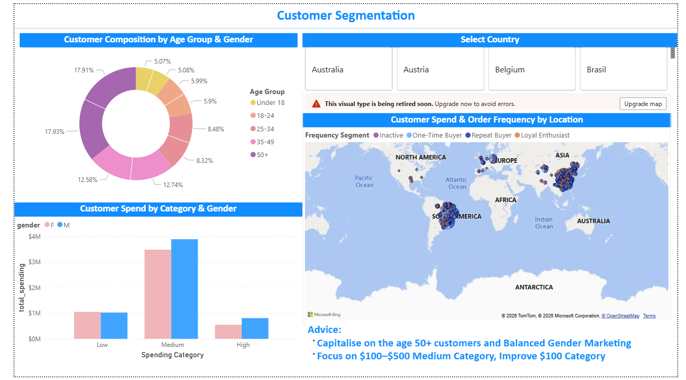
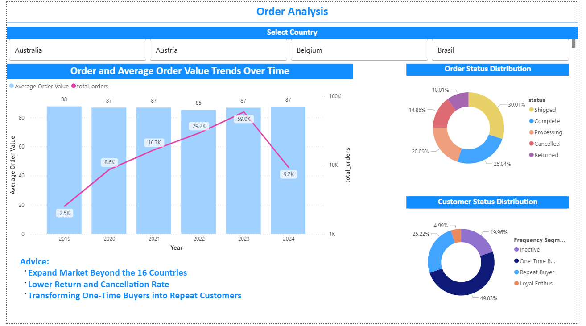

# E-commerce Customer Insights & Revenue Analysis (Power BI)

Power BI dashboard analysing customer segments and order performance for a fictional online clothing retailer, with recommendations to grow revenue and retention.

## Business questions
- Who are the retailer's customers, and which segments spend the most?
- How have order volume and average order value changed over time?
- How many orders are returned or cancelled, and how many customers buy only once?

## Data & tools
- **Data:** TheLook eCommerce public dataset (Google BigQuery): users, orders, order items, products, inventory items, distribution centres and web events
- **Tools:** Power BI (Power Query for cleaning, DAX measures, star-schema data model)
- **Key measures:** total spending, total orders, average order value (AOV)
- **Segments created:** customer age groups, spending categories (e.g. under $100, $100–$500), and purchase frequency segments (one-time vs repeat)

## Dashboard

### Page 1: Customer Segmentation

Customer composition by age group and gender, spend by spending category, and a map of spend and order frequency by location, filterable by country.

### Page 2: Order Analysis

Order volume and AOV trends by year, quarter and month, order status distribution, and the split between one-time and repeat customers.

## Key findings
- Customers aged 50+ make up 34% of the customer base and 36% of total spending.
- Spending is evenly balanced between genders (50% female, 50% male).
- The $100–$500 spending category generates 68% of revenue, while customers spending under $100 account for 63% of customers but only 19% of revenue.
- 25% of orders were returned or cancelled.
- 50% of customers have made only one purchase.
- Sales come from 16 countries, led by China (34% of revenue).

## Recommendations
1. **Prioritise the 50+ segment** with targeted campaigns, while keeping marketing balanced across genders.
2. **Grow the $100–$500 segment** and move under-$100 customers up through bundles and personalised recommendations.
3. **Convert one-time buyers into repeat customers** with post-purchase follow-ups and a loyalty programme.
4. **Reduce returns and cancellations** by investigating which products and categories drive them.
5. **Explore expansion beyond the current 16 markets**, using the best-performing countries as a model.

## Files
- `Ecommerce_Dashboard.pdf`: all dashboard pages
- `project.pbix`: Power BI file (requires Power BI Desktop on Windows)
